# Vriksham Jobs ATS: Enterprise User Training & Operational Guide

Welcome to the **Vriksham Jobs ATS User Guide**. This guide is written for recruiters, account managers, and administrators. It explains every feature in simple language with real-life analogies, prerequisites, step-by-step instructions, and visual UI screenshots.

---

## 1. Executive Overview & Regional Standards

Vriksham Jobs ATS is our central recruitment platform. To make sure everyone on the team works smoothly without data errors, every record follows standard Indian recruitment rules.

### Plain-English Standards:
- **Currency Standard (Rupees ₹)**: All salaries, CTC ranges, and placement rates are strictly in **Indian Rupee (INR ₹)**.
- **Phone Number Standard (+91)**: All mobile numbers format automatically to the Indian 10-digit format (`98765 43210`) with a fixed **`+91`** country code prefix.
- **Smart Copy-Paste**: When you paste any phone number (even messy ones with dashes or extra spaces like `09876543210` or `+91-98765-43210`), the system automatically cleans it and extracts the exact 10-digit mobile number.
- **Division Scoping**: Every record belongs to a team division (for example: *Mangalore Hiring Team*).

---

## 2. Order of Operations: What Must Be Created First?

In recruitment, you cannot send a candidate to a client if the client company does not exist in the system yet. Following the correct step-by-step sequence saves time and prevents mistakes.

### Simple Creation Sequence:

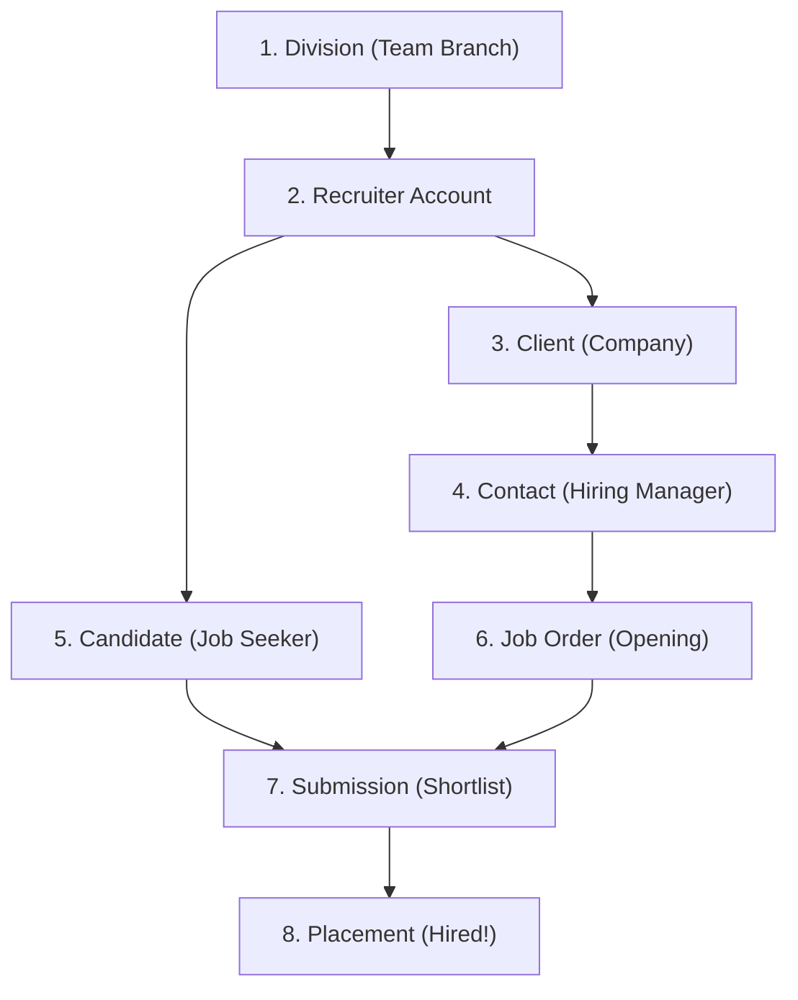

---

### Prerequisites Cheat-Sheet

| Step | Entity | Plain-English Explanation | What Must Exist First? |
|---|---|---|---|
| **1** | **Division** | Your team branch or department (for example: *Mangalore Hiring Team*). | Admin User |
| **2** | **Recruiter** | The login account for each team member using the ATS. | Division |
| **3** | **Client** | The employer/company hiring talent (for example: *Acme Technologies*). | Division & Recruiter |
| **4** | **Contact** | The specific person or manager working at the Client company. | **Client Company** |
| **5** | **Job Order** | The specific job opening given to us by a Client (for example: *React Developer*). | **Client** AND **Contact** |
| **6** | **Candidate** | A job seeker or applicant stored in our talent database. | Division & Recruiter |
| **7** | **Submission** | Nominating a Candidate's resume for a specific Job Order. | Candidate & Job Order |
| **8** | **Placement** | The final record created when a candidate is successfully hired! | Candidate, Job Order, Client |

---

## 3. Step-by-Step Module Guide

---

### Module 1: Divisions & Recruiter Setup

#### What is a Division in simple terms?
Think of a **Division** as your team's digital branch office (for example: *Mangalore Hiring Team*). It groups team members, candidates, and client accounts into a shared container.

#### Data Access Modes:
- **Collaborative**: Everyone in the team can see and share records.
- **Owner Only**: Recruiters only see records they explicitly own.

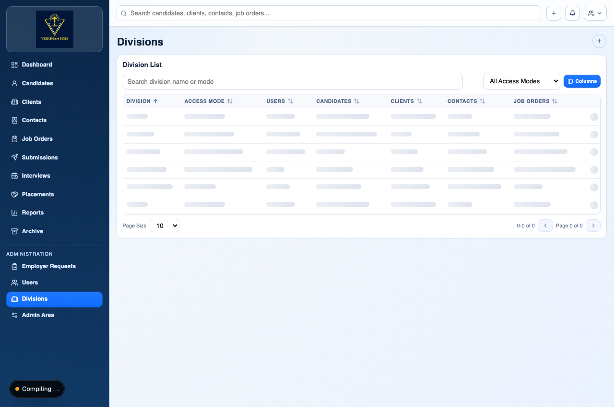

#### What is a Recruiter / User Profile in simple terms?
This is the personal login account for each recruiter or manager on your team. Every recruiter is linked to a Division and assigned a role (*Administrator*, *Director*, or *Recruiter*).

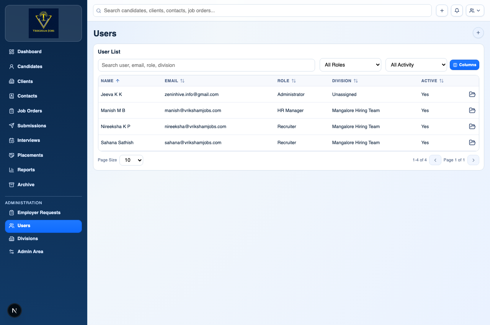

---

### Module 2: Clients (Employer Companies)

#### What is a Client in simple terms?
A **Client** is the company or business that hires our recruitment agency to find talent for them (for example: *Wipro*, *Infosys*, or *Acme Tech Pvt Ltd*).

#### Why do we need it first?
You cannot create a contact person or a job opening without first creating the Client company profile.

- **Prerequisites**: Division and Assigned Recruiter (Owner).
- **Required Fields (`*`)**: Company Name, Status, Division, Assigned Recruiter.

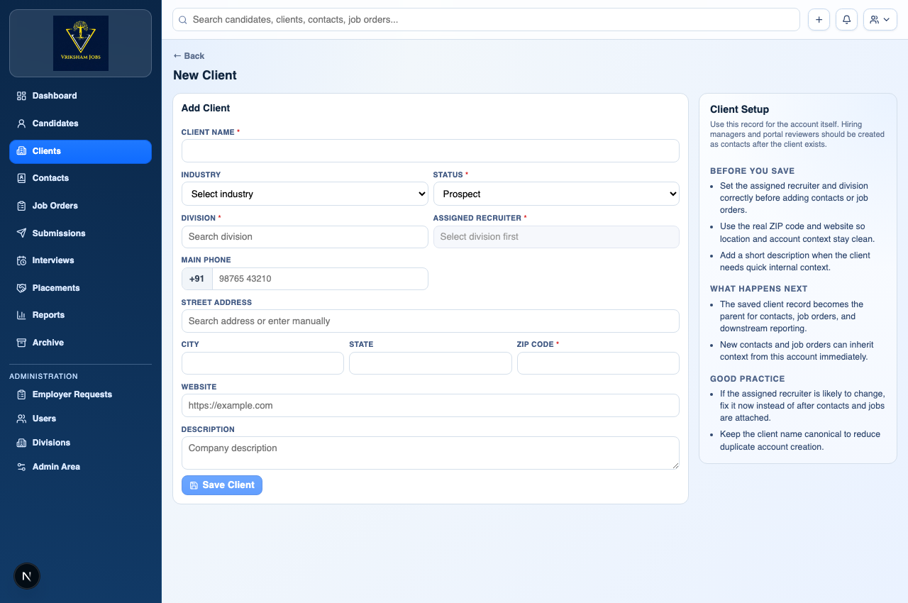

#### How to create a Client step-by-step:
1. Click **Clients ➔ New Client** from the left navigation menu.
2. Type the **Company Name** (for example: *Acme Technologies*).
3. Select **Status** (*Active* or *Prospect*).
4. Select your **Division** (for example: *Mangalore Hiring Team*) and **Assigned Recruiter**.
5. Click **Save Client**.

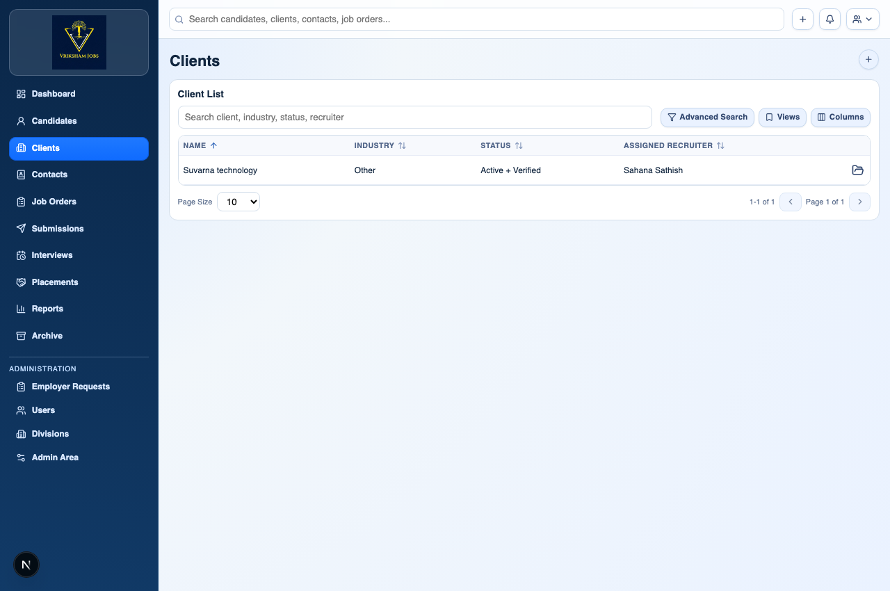

---

### Module 3: Contacts (Client Representatives / Hiring Managers)

#### What is a Contact in simple terms?
A **Contact** is an actual person who works at the Client company: specifically the HR Manager, Talent Manager, or Engineering Lead who gives us job requirements and interviews our candidates.

> 💡 **Real-Life Analogy**: If *Acme Technologies* is the **Client Company**, then *Mr. Rajesh Sharma (HR Head at Acme)* is the **Contact Person**.

#### Why do we need it?
When we submit candidates or send job updates, we send them directly to the Contact person.

- **Prerequisites**: **Client (Company)** must be created first!
- **Required Fields (`*`)**: First Name, Last Name, Email, Mobile (+91 format), Source, Division, Recruiter, **Client Company**.

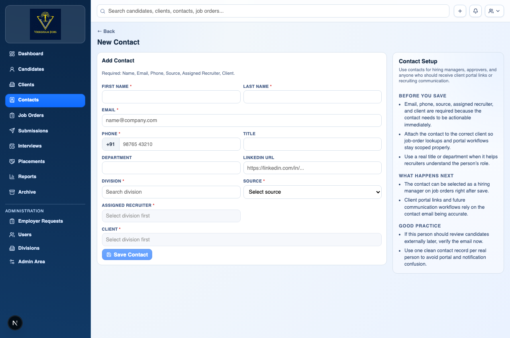

#### How to create a Contact step-by-step:
1. Click **Contacts ➔ New Contact** or click **Add Contact** directly from a Client's detail page.
2. Select the parent **Client Company** (for example: *Acme Technologies*).
3. Enter the person's **First Name** and **Last Name** (for example: *Rajesh Sharma*).
4. Enter their **Email** and **Mobile Number** (Auto-formats with `+91`).
5. Select **Division** and **Assigned Recruiter**.
6. Click **Save Contact**.

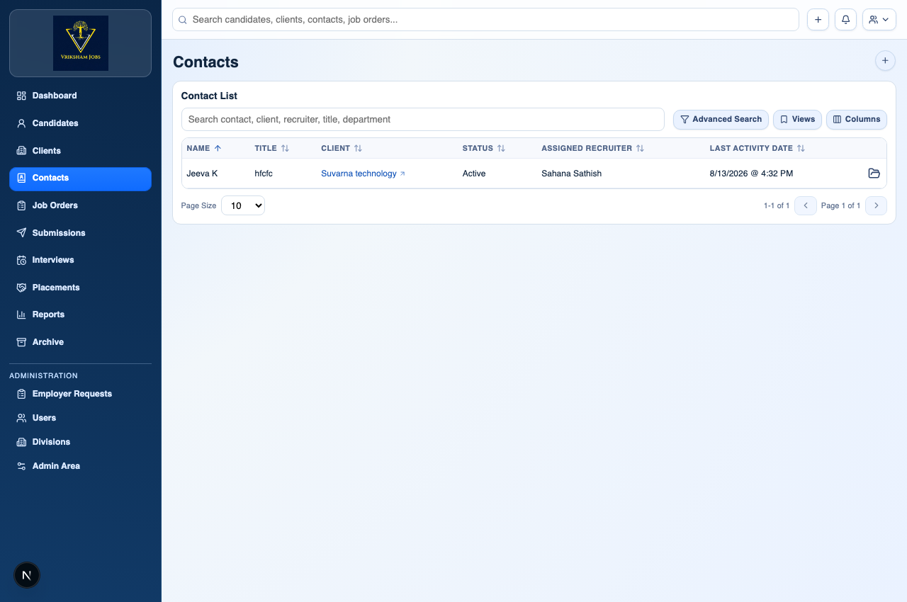

---

### Module 4: Job Orders (Job Openings / Requisitions)

#### What is a Job Order in simple terms?
A **Job Order** is an active job opening or mandate given to us by a Client company (for example: *2 Openings for Senior React Developer at Acme Tech*).

#### Why do we need it?
It defines what kind of candidate the client is looking for, how many people to hire, the salary range in Rupees (₹), and who the hiring contact is.

- **Prerequisites**: Both the **Client Company** AND the **Contact Person** must exist first!
- **Required Fields (`*`)**: Job Title, Status, Openings, Division, Recruiter, **Client**, **Contact**.

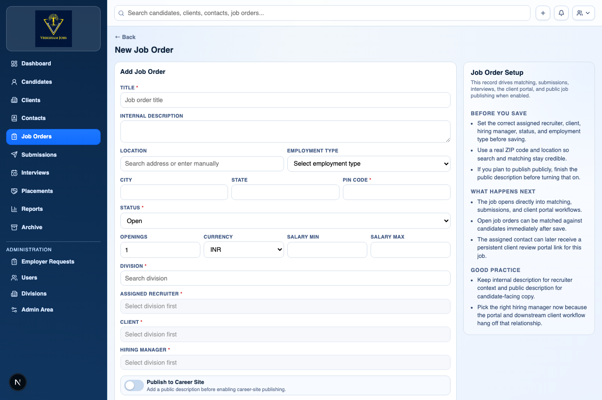

#### How to create a Job Order step-by-step:
1. Click **Job Orders ➔ New Job Order**.
2. Type the **Job Title** (for example: *Senior React Developer*).
3. Select the employer **Client Company** and the hiring **Contact** person.
4. Set **Openings** (for example: `2`).
5. Enter Salary range in **INR (₹)**.
6. Select **Division** and **Assigned Recruiter**.
7. Click **Save Job Order**.

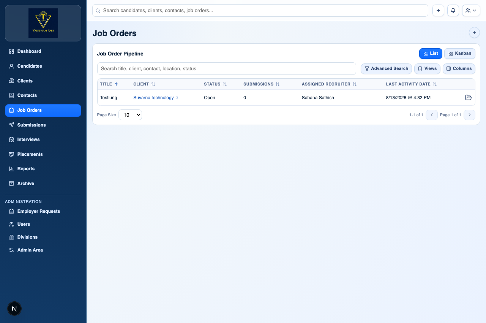

---

### Module 5: Candidates (Job Seekers / Talent Database)

#### What is a Candidate in simple terms?
A **Candidate** is a job seeker or professional whose resume and profile are stored in our talent database.

#### Why do we need it?
This is our talent pool. Every candidate profile holds their resume, skills, contact details, work history, and interview feedback.

- **Prerequisites**: Division and Assigned Recruiter.
- **Required Fields (`*`)**: First Name, Last Name, Email, Mobile (+91 format), Status, Source, Division, Recruiter.

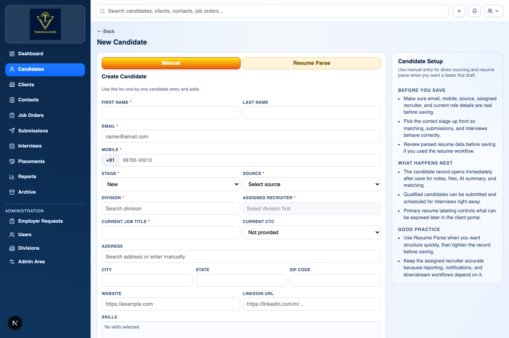

#### How to add a Candidate step-by-step:
1. Click **Candidates ➔ New Candidate**.
2. Upload a **Resume PDF/Word document** (AI will parse skills and work history automatically!) OR enter details manually.
3. Verify Name, Email, and **Mobile Number** (Indian `+91` format enforced).
4. Select **Division** (for example: *Mangalore Hiring Team*) and **Assigned Recruiter**.
5. Click **Save Candidate**.

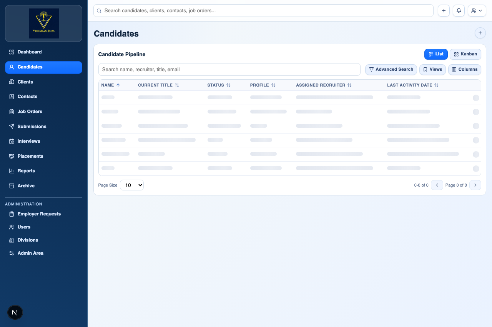

---

### Module 6: Submissions (Shortlisting Candidates for Jobs)

#### What is a Submission in simple terms?
A **Submission** means shortlisting a Candidate from our database and presenting their profile/resume for a specific open Job Order.

- **Prerequisites**: Candidate AND Job Order must both exist!

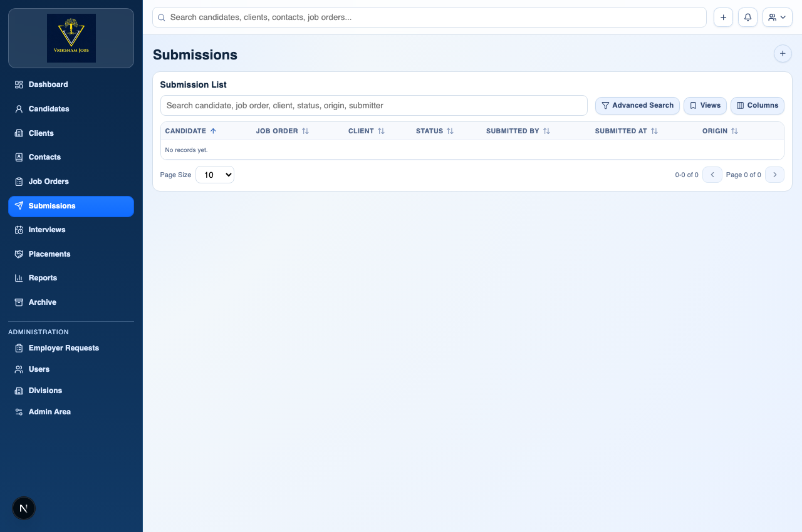

---

### Module 7: Interviews (Scheduling Meetings)

#### What is an Interview in simple terms?
An **Interview** is a scheduled meeting (phone screening, video call, or client interview) between a Candidate and the interviewer.

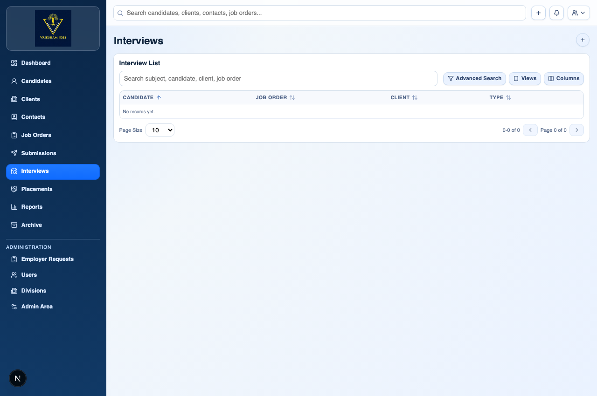

---

### Module 8: Placements (Successful Hires!)

#### What is a Placement in simple terms?
A **Placement** is the final record created when a candidate is officially selected, accepts the offer, and gets hired by the client company! It records the join date, offered salary (₹), and agency billing terms.

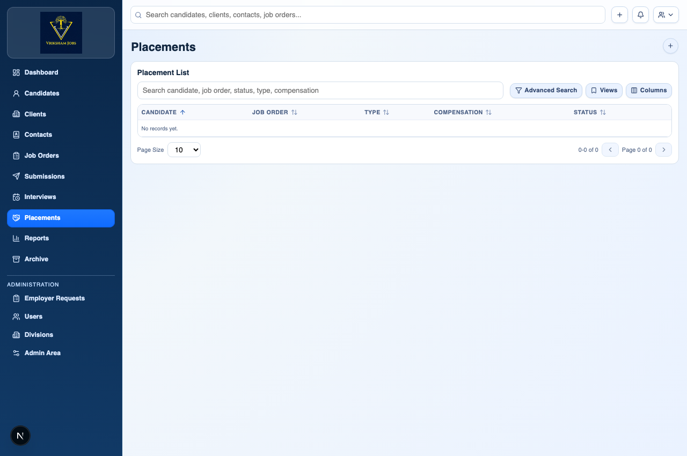

---

## 4. Quick Summary Checklist for Recruiters

Before creating any record, quickly check this list:

- [ ] **Adding a Client?** ➔ Make sure you know which Division and Recruiter will own it.
- [ ] **Adding a Contact?** ➔ Create the **Client Company** first!
- [ ] **Creating a Job Order?** ➔ Make sure both **Client Company** and **Contact Person** are selected.
- [ ] **Adding a Candidate?** ➔ Enter mobile number using the 10-digit Indian format (`+91` is automatic).
- [ ] **Entering Salary / CTC?** ➔ Enter all figures in **INR (₹)**.
