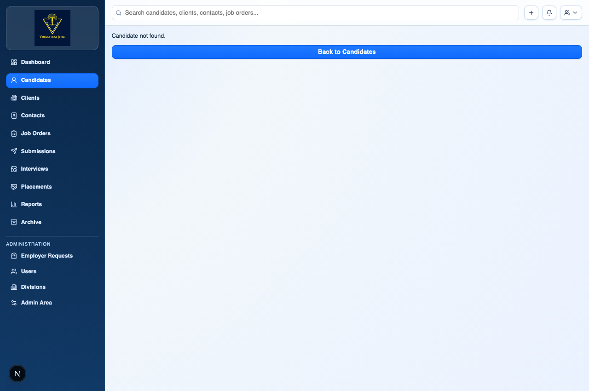
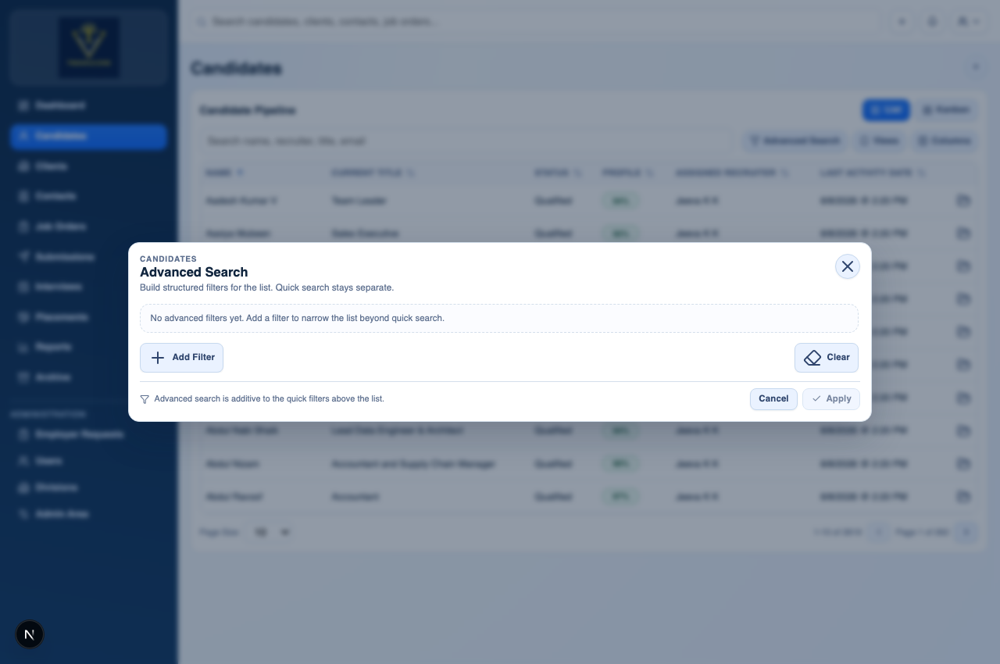
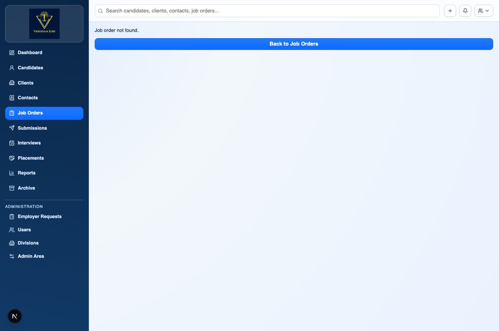
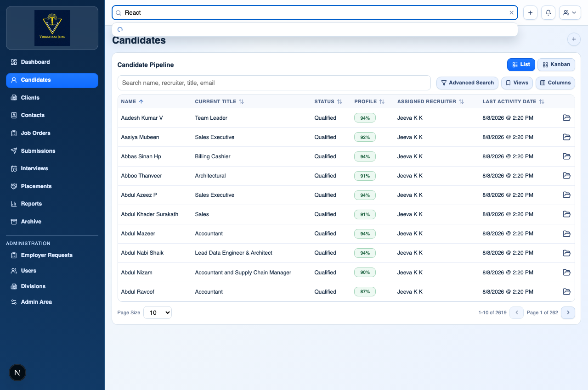

# Vriksham Jobs ATS: Master Recruiter Training & Operational Guide

Welcome to the **Vriksham Jobs ATS Master User Guide**. This document is the primary reference manual for recruiters, account managers, and administrators. It explains every feature in simple language with real-life analogies, prerequisites, step-by-step instructions, and visual UI screenshots.

---

## Table of Contents

- [<strong style="color:#2563eb;">Section 1: Executive Overview & Regional Standards</strong>](#section-1)
  - [1.1 Purpose of Vriksham Jobs ATS](#section-1-1)
  - [1.2 Regional Standards (Rupees ₹ and +91 Phone Rules)](#section-1-2)
- [<strong style="color:#2563eb;">Section 2: Master Entity Sequence & Prerequisites</strong>](#section-2)
  - [2.1 Order of Operations (What Must Be Created First?)](#section-2-1)
  - [2.2 Visual Workflow Diagram](#section-2-2)
  - [2.3 Prerequisites Cheat-Sheet Matrix](#section-2-3)
- [<strong style="color:#2563eb;">Section 3: Core Recruiter Modules</strong>](#section-3)
  - [3.1 Module 1: Divisions & Recruiter Setup](#module-1)
  - [3.2 Module 2: Clients (Employer Companies)](#module-2)
  - [3.3 Module 3: Contacts (Client Representatives & Hiring Managers)](#module-3)
  - [3.4 Module 4: Job Orders (Job Mandates & Requisitions)](#module-4)
  - [3.5 Module 5: Candidates (Job Seekers & Resume Parsing)](#module-5)
  - [3.6 Module 6: Submissions (Shortlisting Candidates)](#module-6)
  - [3.7 Module 7: Interviews (Scheduling Meetings)](#module-7)
  - [3.8 Module 8: Placements (Successful Hires & Billing Terms)](#module-8)
- [<strong style="color:#2563eb;">Section 4: Advanced Recruiter Features</strong>](#section-4)
  - [4.1 Module 9: AI Resume Parsing & Automated Candidate Matching](#module-9)
  - [4.2 Module 10: Inbound Email Sync & Outbound Email Drafting](#module-10)
  - [4.3 Module 11: Advanced Search, Filtering & Record Merging](#module-11)
  - [4.4 Module 12: Submissions Workspace & Client Portal Control](#module-12)
- [<strong style="color:#2563eb;">Section 5: Recruiter Power Tools & Quick References</strong>](#section-5)
  - [5.1 Module 13: Keyboard Shortcuts & Global Quick Search](#module-13)
  - [5.2 Module 14: Ready-to-Use Outreach & WhatsApp Templates](#module-14)
  - [5.3 Module 15: Candidate Stage Lifecycle & Pipeline Rules](#module-15)
  - [5.4 Module 16: Recruiter Troubleshooting FAQ](#module-16)
- [<strong style="color:#2563eb;">Section 6: Operational Summary Checklist</strong>](#section-6)

---

<h2 id="section-1">Section 1: Executive Overview & Regional Standards</h2>

Vriksham Jobs ATS is our central recruitment platform. To make sure everyone on the team works smoothly without data errors, every record follows standard Indian recruitment rules.

<h3 id="section-1-1">1.1 Purpose of Vriksham Jobs ATS</h3>
Vriksham Jobs ATS automates the full recruitment lifecycle from employer account creation to hiring and placement billing.

<h3 id="section-1-2">1.2 Regional Standards (Rupees ₹ and +91 Phone Rules)</h3>
<ul>
  <li><strong>Currency Standard (Rupees ₹)</strong>: All salaries, CTC ranges, and placement rates are strictly in <strong>Indian Rupee (INR ₹)</strong>.</li>
  <li><strong>Phone Number Standard (+91)</strong>: All mobile numbers format automatically to the Indian 10-digit format (<code>98765 43210</code>) with a fixed <strong><code>+91</code></strong> country code prefix.</li>
  <li><strong>Smart Copy-Paste</strong>: When you paste any phone number (even messy ones with dashes or extra spaces like <code>09876543210</code> or <code>+91-98765-43210</code>), the system automatically cleans it and extracts the exact 10-digit mobile number.</li>
  <li><strong>Division Scoping</strong>: Every record belongs to a team division (for example: <em>Mangalore Hiring Team</em>).</li>
</ul>

---

<h2 id="section-2">Section 2: Master Entity Sequence & Prerequisites</h2>

In recruitment, you cannot send a candidate to a client if the client company does not exist in the system yet. Following the correct step-by-step sequence saves time and prevents mistakes.

<h3 id="section-2-1">2.1 Order of Operations</h3>
Always follow the mandatory creation sequence: Division ➔ Recruiter ➔ Client ➔ Contact ➔ Candidate ➔ Job Order ➔ Submission ➔ Placement.

<h3 id="section-2-2">2.2 Visual Workflow Diagram</h3>

  

    
1

    

      
Division

      
Team Branch

    

  

  
➔

  

    
2

    

      
Recruiter

      
User Account

    

  

  
➔

  

    
3

    

      
Client

      
Employer Company

    

  

  
➔

  

    
4

    

      
Contact

      
Hiring Manager

    

  

  

  

    
5

    

      
Candidate

      
Job Seeker

    

  

  
➔

  

    
6

    

      
Job Order

      
Opening Requisition

    

  

  
➔

  

    
7

    

      
Submission

      
Shortlisted Resume

    

  

  
➔

  

    
8

    

      
Placement

      
Hired! Deal Closed

    

  

<h3 id="section-2-3">2.3 Prerequisites Cheat-Sheet Matrix</h3>

| Step | Entity | Plain-English Explanation | What Must Exist First? |
|---|---|---|---|
| **1** | **Division** | Your team branch or department (for example: *Mangalore Hiring Team*). | Admin User |
| **2** | **Recruiter** | The login account for each team member using the ATS. | Division |
| **3** | **Client** | The employer/company hiring talent (for example: *Acme Technologies*). | Division & Recruiter |
| **4** | **Contact** | The specific person or manager working at the Client company. | **Client Company** |
| **5** | **Job Order** | The specific job opening given to us by a Client (for example: *React Developer*). | **Client** AND **Contact** |
| **6** | **Candidate** | A job seeker or applicant stored in our talent database. | Division & Recruiter |
| **7** | **Submission** | Nominating a Candidate's resume for a specific Job Order. | Candidate & Job Order |
| **8** | **Placement** | The final record created when a candidate is successfully hired! | Candidate, Job Order, Client |

---

<h2 id="section-3">Section 3: Core Recruiter Modules</h2>

This section contains detailed, step-by-step instructions and visual screenshots for every core module in Vriksham Jobs ATS.

---

<h3 id="module-1">3.1 Module 1: Divisions & Recruiter Setup</h3>

#### What is a Division in simple terms?
Think of a **Division** as your team's digital branch office (for example: *Mangalore Hiring Team*). It groups team members, candidates, and client accounts into a shared container.

#### Data Access Modes:
- **Collaborative**: Everyone in the team can see and share records.
- **Owner Only**: Recruiters only see records they explicitly own.

#### What is a Recruiter / User Profile in simple terms?
This is the personal login account for each recruiter or manager on your team. Every recruiter is linked to a Division and assigned a role (<em>Administrator</em>, <em>Director</em>, or <em>Recruiter</em>).

---

<h3 id="module-2">3.2 Module 2: Clients (Employer Companies)</h3>

#### What is a Client in simple terms?
A **Client** is the company or business that hires our recruitment agency to find talent for them (for example: *Wipro*, *Infosys*, or *Acme Tech Pvt Ltd*).

#### Why do we need it first?
You cannot create a contact person or a job opening without first creating the Client company profile.

- <strong>Prerequisites</strong>: Division and Assigned Recruiter (Owner).
- <strong>Required Fields (<code>*</code>)</strong>: Company Name, Status, Division, Assigned Recruiter.

#### How to create a Client step-by-step:
1. Click <strong>Clients ➔ New Client</strong> from the left navigation menu.
2. Type the <strong>Company Name</strong> (for example: <em>Acme Technologies</em>).
3. Select <strong>Status</strong> (<em>Active</em> or <em>Prospect</em>).
4. Select your <strong>Division</strong> (for example: <em>Mangalore Hiring Team</em>) and <strong>Assigned Recruiter</strong>.
5. Click <strong>Save Client</strong>.

---

<h3 id="module-3">3.3 Module 3: Contacts (Client Representatives / Hiring Managers)</h3>

#### What is a Contact in simple terms?
A **Contact** is an actual person who works at the Client company: specifically the HR Manager, Talent Manager, or Engineering Lead who gives us job requirements and interviews our candidates.

<blockquote>💡 <strong>Real-Life Analogy</strong>: If <em>Acme Technologies</em> is the <strong>Client Company</strong>, then <em>Mr. Rajesh Sharma (HR Head at Acme)</em> is the <strong>Contact Person</strong>.</blockquote>

#### Why do we need it?
When we submit candidates or send job updates, we send them directly to the Contact person.

- <strong>Prerequisites</strong>: <strong>Client (Company)</strong> must be created first!
- <strong>Required Fields (<code>*</code>)</strong>: First Name, Last Name, Email, Mobile (+91 format), Source, Division, Recruiter, <strong>Client Company</strong>.

#### How to create a Contact step-by-step:
1. Click <strong>Contacts ➔ New Contact</strong> or click <strong>Add Contact</strong> directly from a Client's detail page.
2. Select the parent <strong>Client Company</strong> (for example: <em>Acme Technologies</em>).
3. Enter the person's <strong>First Name</strong> and <strong>Last Name</strong> (for example: <em>Rajesh Sharma</em>).
4. Enter their <strong>Email</strong> and <strong>Mobile Number</strong> (Auto-formats with <code>+91</code>).
5. Select <strong>Division</strong> and <strong>Assigned Recruiter</strong>.
6. Click <strong>Save Contact</strong>.

---

<h3 id="module-4">3.4 Module 4: Job Orders (Job Openings / Requisitions)</h3>

#### What is a Job Order in simple terms?
A **Job Order** is an active job opening or mandate given to us by a Client company (for example: *2 Openings for Senior React Developer at Acme Tech*).

#### Why do we need it?
It defines what kind of candidate the client is looking for, how many people to hire, the salary range in Rupees (₹), and who the hiring contact is.

- <strong>Prerequisites</strong>: Both the <strong>Client Company</strong> AND the <strong>Contact Person</strong> must exist first!
- <strong>Required Fields (<code>*</code>)</strong>: Job Title, Status, Openings, Division, Recruiter, <strong>Client</strong>, <strong>Contact</strong>.

#### How to create a Job Order step-by-step:
1. Click <strong>Job Orders ➔ New Job Order</strong>.
2. Type the <strong>Job Title</strong> (for example: <em>Senior React Developer</em>).
3. Select the employer <strong>Client Company</strong> and the hiring <strong>Contact</strong> person.
4. Set <strong>Openings</strong> (for example: <code>2</code>).
5. Enter Salary range in <strong>INR (₹)</strong>.
6. Select <strong>Division</strong> and <strong>Assigned Recruiter</strong>.
7. Click <strong>Save Job Order</strong>.

---

<h3 id="module-5">3.5 Module 5: Candidates (Job Seekers / Talent Database)</h3>

#### What is a Candidate in simple terms?
A **Candidate** is a job seeker or professional whose resume and profile are stored in our talent database.

#### Why do we need it?
This is our talent pool. Every candidate profile holds their resume, skills, contact details, work history, and interview feedback.

- <strong>Prerequisites</strong>: Division and Assigned Recruiter.
- <strong>Required Fields (<code>*</code>)</strong>: First Name, Last Name, Email, Mobile (+91 format), Status, Source, Division, Recruiter.

#### How to add a Candidate step-by-step:
1. Click <strong>Candidates ➔ New Candidate</strong>.
2. Upload a <strong>Resume PDF/Word document</strong> (AI will parse skills and work history automatically!) OR enter details manually.
3. Verify Name, Email, and <strong>Mobile Number</strong> (Indian <code>+91</code> format enforced).
4. Select <strong>Division</strong> (for example: <em>Mangalore Hiring Team</em>) and <strong>Assigned Recruiter</strong>.
5. Click <strong>Save Candidate</strong>.

---

<h3 id="module-6">3.6 Module 6: Submissions (Shortlisting Candidates for Jobs)</h3>

#### What is a Submission in simple terms?
A **Submission** means shortlisting a Candidate from our database and presenting their profile/resume for a specific open Job Order.

- <strong>Prerequisites</strong>: Candidate AND Job Order must both exist!

---

<h3 id="module-7">3.7 Module 7: Interviews (Scheduling Meetings)</h3>

#### What is an Interview in simple terms?
An **Interview** is a scheduled meeting (phone screening, video call, or client interview) between a Candidate and the interviewer.

---

<h3 id="module-8">3.8 Module 8: Placements (Successful Hires!)</h3>

#### What is a Placement in simple terms?
A **Placement** is the final record created when a candidate is officially selected, accepts the offer, and gets hired by the client company! It records the join date, offered salary (₹), and agency billing terms.

---

<h2 id="section-4">Section 4: Advanced Recruiter Features</h2>

---

<h3 id="module-9">4.1 Module 9: AI Resume Parsing & Automated Candidate Matching</h3>

#### What is AI Resume Parsing & Matching in simple terms?
When you upload a resume (PDF or Word document), our AI system automatically reads the document and extracts the candidate's name, email, mobile number, skills, education, and past work history so you do not have to type it manually.

<blockquote>💡 <strong>Real-Life Analogy</strong>: Think of AI Resume Parsing as an automated assistant that reads a 5-page resume in 2 seconds and fills out the candidate creation form for you.</blockquote>

#### How Candidate Qualification Scoring Works:
- Every candidate profile is given a **Profile Completeness & Quality Score** (displayed as a compact score chip on candidate lists).
- When matching a candidate to a Job Order, click **"Explain Match"** on the submission card.
- **Explain Match** opens an instant AI report showing:
  1. **Candidate Strengths**: Why this candidate fits the role.
  2. **Skill & Experience Gaps**: What qualifications might be missing.
  3. **Suggested Interview Questions**: What specific questions the recruiter should ask during screening.

---

<h3 id="module-10">4.2 Module 10: Inbound Email Sync & Outbound Recruiter Email Drafting</h3>

#### What is Inbound Email Sync in simple terms?
When candidates send resumes to our agency inbox, the ATS automatically matches the email address to existing candidate profiles and attaches the inbound email as a timeline note.

#### How Automatic Resume File Attachment Works:
- If a candidate emails a new resume PDF or Word file, the file is automatically saved into the candidate's **Files & Resumes** section without any manual downloading.

#### How Outbound Email Drafting Works:
1. Open any Candidate or Contact detail page.
2. Click **Draft Email** from the action toolbar.
3. Select your purpose (for example: *Outreach to Passive Candidate*, *Interview Invitation*, or *Candidate Submission Summary*).
4. Click **Generate Draft**: AI generates a personalized subject line and message body.
5. Click **Copy to Clipboard** to paste directly into your email client or WhatsApp!

---

<h3 id="module-11">4.3 Module 11: Advanced Search, Filtering & Record Merging</h3>

#### What is Advanced Candidate Search in simple terms?
When your candidate database grows to thousands of records, quick text lookup is not enough. **Advanced Search** lets you combine multiple search rules together.

> 💡 <strong>Example Search Query</strong>: Find candidates where <em>Resume Keywords contains React</em> AND <em>Completeness >= 80%</em> AND <em>Last Activity in past 14 days</em>.

#### Duplicate Candidate Detection & Merging:
- When adding a new candidate, the ATS automatically checks for matching emails or mobile numbers.
- If a potential duplicate is found, the system displays a **Duplicate Warning Badge** with a match confidence score.
- Click **Merge Candidate** to merge duplicate profiles into a single clean master record without losing past notes, files, or submission history.

---

<h3 id="module-12">4.4 Module 12: Submissions Workspace & Client Portal Control</h3>

#### What is the Submissions Workspace in simple terms?
The **Submissions Workspace** is the candidate delivery dashboard for a Job Order. It shows all candidates shortlisted for that specific opening, their stage, and client feedback.

#### How Priority Order Ranking Works:
- Switch the sort view to **Priority Order**.
- **Drag and Drop** candidate rows up or down to rank them by recruiter preference (for example: placing your top recommended candidate at Position #1).
- The priority ranking persists automatically for all recruiters in your division.

#### Managing Client Portal Visibility & Career-Site Applications:
- Candidates applying directly via the public career site start with a **`Web`** tag and are hidden from the employer portal until reviewed.
- Click **Promote to Client Portal** on a submission row to make the candidate's resume and write-up visible to the client hiring manager.
- View live client feedback, ratings, and interview requests directly on submission rows as hiring managers review candidates on their portal.

---

<h2 id="section-5">Section 5: Recruiter Power Tools & Quick References</h2>

---

<h3 id="module-13">5.1 Module 13: Keyboard Shortcuts & Global Quick Search</h3>

#### How Global Quick Search Works:
The **Global Quick Search** input at the top of the screen lets you search across all records instantly. Type a candidate name, mobile number, client company, or job title to view instant suggestions.

#### Handy Quick-Action Shortcuts:
- **Instant WhatsApp Link**: Clicking the WhatsApp icon next to any candidate or contact phone number opens a direct WhatsApp chat window with the number pre-formatted in Indian `+91` format!
- **One-Click Copy**: Copy candidate email, phone, or resume summary directly to clipboard with one click.

---

<h3 id="module-14">5.2 Module 14: Ready-to-Use Outreach & WhatsApp Templates</h3>

Recruiters can use these standard message templates to reach out to candidates and hiring managers quickly.

#### Template A: Candidate First Outreach (WhatsApp / Email)
> Hi <strong>[Candidate First Name]</strong>, I came across your profile on Vriksham Jobs. We have an active opening for a <strong>[Job Title]</strong> at <strong>[Client Company / Industry]</strong> offering <strong>[Salary Band / CTC in ₹]</strong>. Would you be open for a quick 5-minute call today? Best regards, <strong>[Your Name]</strong> from Vriksham Jobs.

#### Template B: Interview Confirmation (Sent to Candidate)
> Hi <strong>[Candidate First Name]</strong>, your interview for <strong>[Job Title]</strong> with <strong>[Client Company]</strong> is scheduled for <strong>[Date & Time]</strong>. Meeting Link / Location: <strong>[Link / Address]</strong>. Interviewer: <strong>[Contact Name]</strong>. Please join 5 minutes early. Good luck! Vriksham Jobs Team.

#### Template C: Client Candidate Pitch (Sent to Hiring Manager Contact)
> Dear <strong>[Contact Name]</strong>, we have shortlisted <strong>[Candidate Name]</strong> for the <strong>[Job Title]</strong> mandate. Key Highlights: <strong>[Experience Years]</strong> years exp, Current CTC: <strong>[INR ₹]</strong>, Notice Period: <strong>[Notice Days]</strong>. You can review their full verified profile on your Client Portal here: <strong>[Portal Link]</strong>. Best, <strong>[Your Name]</strong>, Vriksham Jobs.

---

<h3 id="module-15">5.3 Module 15: Candidate Stage Lifecycle & Pipeline Rules</h3>

Understanding the exact meaning of every candidate stage ensures consistent data hygiene across the agency team:

| Stage Name | Plain-English Definition | Mandatory Recruiter Action Required |
|---|---|---|
| **New** | Newly added candidate whose profile has not been screened yet. | Review resume and complete contact details. |
| **Screened** | Candidate has been spoken to and meets basic criteria. | Update CTC (INR ₹), Notice Period, and Location. |
| **Submitted** | Candidate profile presented to Client for a Job Order. | Add submission notes and set Priority Order. |
| **Interview Scheduled** | Client selected candidate for a screening/tech round. | Record interview date, time, and interviewer link. |
| **Offered** | Client extended an official offer letter to candidate. | Enter offered CTC in INR (₹) and expected join date. |
| **Placed** | Candidate accepted offer and successfully joined! | Create Placement record and set billing terms. |
| **Rejected** | Candidate passed on by client or declined offer. | Select a Status Change Reason for audit tracking. |

---

<h3 id="module-16">5.4 Module 16: Recruiter Troubleshooting FAQ (Common Issues Solved)</h3>

#### Question 1: Why is the Contact dropdown empty when creating a Job Order?
- **Answer**: Contacts are tied to Client companies. You must select the **Client Company** first in the form before the Contact dropdown populates!

#### Question 2: What should I do if a Candidate shows a Duplicate Warning?
- **Answer**: Click the warning badge to view matching emails/phones. If it is the same person, click **Merge Candidate** to combine records cleanly without losing history.

#### Question 3: Why can't the Client see a candidate I submitted on their Client Portal?
- **Answer**: Applications coming from the public career site start with a `Web` tag and are hidden by default. Open the submission row and click **Promote to Client Portal**.

#### Question 4: Why does a phone number show format warning when typing?
- **Answer**: All mobile numbers enforce the 10-digit Indian mobile standard with fixed `+91`. Simply type or paste the 10-digit number (e.g. `9876543210`) and the system cleans it automatically.

---

<h2 id="section-6">Section 6: Operational Summary Checklist</h2>

Before creating any record, quickly check this list:

- [ ] <strong>Adding a Client?</strong> ➔ Make sure you know which Division and Recruiter will own it.
- [ ] <strong>Adding a Contact?</strong> ➔ Create the <strong>Client Company</strong> first!
- [ ] <strong>Creating a Job Order?</strong> ➔ Make sure both <strong>Client Company</strong> and <strong>Contact Person</strong> are selected.
- [ ] <strong>Adding a Candidate?</strong> ➔ Enter mobile number using the 10-digit Indian format (<code>+91</code> is automatic).
- [ ] <strong>Entering Salary / CTC?</strong> ➔ Enter all figures in <strong>INR (₹)</strong>.
- [ ] <strong>Submitting a Candidate?</strong> ➔ Use <strong>Explain Match</strong> to verify candidate strengths and set <strong>Priority Order</strong> ranking.
